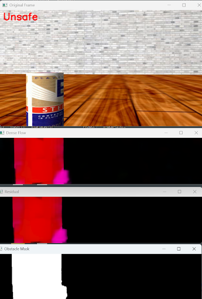
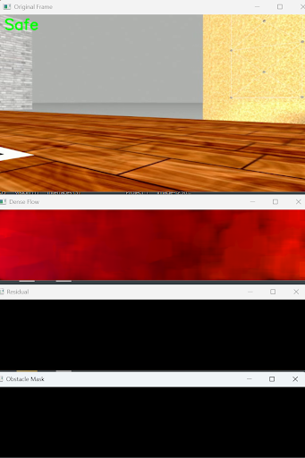
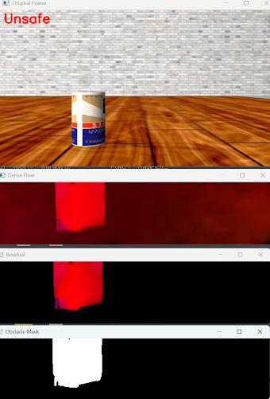

# Demonstrating an Established Optical-Flow-Based Method for Mobile Robot Dynamic Obstacle Detection 

## Purpose
TODO: Explain how this project is the result of a two week assignment for a graduate course on robot perception. 

## The Basic Premise
The approach is premised on the following: 
* The mathematical technique of dense optical flow provides an estimation of pixel motion between robot camera images taken closely together in time. The technique takes as input two such frames and produces as output a field of R2 vectors showing pixel translational motion. The pixel motion is caused by relative motion between the robot camera and all of the objects in the robot’s scene. 
* It has been shown in the literature that if we assume that this relative motion is caused only by the rotation and translation of the robot’s camera and that the robot’s camera scene is largely planar, then the optical flow field can be approximated by a single affine transformation (linear transformation plus translation).
* If we reproject all pixels from the first frame with the approximation affine transformation and compare their landing spots with the landing spots computed with a dense optical flow algorithm, then we reveal all segments of the image that deviate from our assumptions, providing a way of dynamic obstacle detection even when the robot itself is moving.

## The Mathematics that Explain the Premise
TODO: Show why an affine does well to approximate a robot's own ego motion when the above conditions hold. 

## The Implementation
The implementation involved the following:

* Standardizing frames obtained from the TurtleBot robot through a resizing operation to reduce computational complexity and a crop around an ROI operation to enforce the planar assumption. 
* Computing the optical flow between successive frames using OpenCV’s Farneback Dense Optical Flow framework (`cv2.calcOpticalFlowFarneback()`) with the default recommended settings.
* Developing an estimation affine 2x3 transformation matrix to model relative motion caused only by the robot’s own motion. This we accomplished with `cv2.estimateAffinePartial2D()` set with RANSAC.
* Developing a detection mask based on the reprojection error between the estimated affine transformation and the apparent motion computed with dense optical flow.
* Stopping the robot when the detection mask, smoothed temporally to maintain object constancy, fills beyond a static threshold. 

## The Results and The Challenges
We are realizing the following results and challenges:
* In repeated trials in simulation tool Gazebo, we have realized accurate dynamic obstacle detection with no false positives. This is demonstrated by the ROS2 node flagging the robot’s approach to the moving obstacle soda can as being `unsafe` but not flagging any other scenes as being `unsafe`. 
* The fact that our implementation relies on static thresholding for the RANSAC affine fitting step and for the final decision maker step means results will always be scene dependent and will always require parameter tuning. 
    * For example, we have found that the increasing the RANSAC inlier threshold reduces false positives at the sacrifice of not always detecting true dynamic obstacle motion. 
    * Moreover, we have realized that lowering the threshold requirement for mask inliers increases the frequency of false detections.

* Conceptually, the approach as a whole is premised on that dynamic obstacles never occupy the majority of pixels in any pair of successive frames. When this assumption fails to hold true, detections are meaningless.
    * Think of several dozen moving soda cans flooding the robot’s field of view. If this were to happen, the affine fit representing the robot’s own “ego” motion would too much be actually modeling the motion of dynamic obstacles.

### Result Case 1. Robot stationary and dynamic obstacle present.

### Result Case 2. Robot moving and dynamic obstacle present

### Result Case 3. Robot moving and dynamic obstacle present 

## The Conclusion
* In conclusion, we have validated a well-established conceptual framework for dynamic obstacle detection–one that centers on operating on the direct comparison between computed, apparent dense optical flow and a RANSAC-fitted affine transformation summarizing the “gist” of this dense flow field. That being said, while our results have been intriguing, a truly robust, practical rendition–immune to changes in scene and free from guess and check hard-coded parameter settings–would require additional time researching and understanding more of what’s already been achieved in the literature and in industry. 

## References
1. https://oa.upm.es/21899/1/GONZALO_RUY_RODRIGUEZ_CANOSA.pdf   
2. https://www.weizmann.ac.il/math/ronen/sites/math.ronen/files/uploads/basri_-_paraperspective_affine.pdf   