# Leveraging Dense Optical Flow and RANSAC-fitted Affine Homographies to Differentiate Robot Self-Motion from Dynamic Obstacle Motion in Monocular Camera Image Sequences

## Background
In this project, I demonstrate the validity of an established method for dynamic obstacle detection with monocular camera images and dense optical flow. The method involves differentiating between a robot's self-motion and true dynamic obstacles by means of comparing, at each time step, dense optical flow to projections under RANSAC-fitted affine homographies. Although this project is largely preliminary, I focus on explaining the underlying premises of the approach, developing the mathematics, and performing exploratory testing with a model differential drive wheeled robot (TurtleBot 3) in simulation environment Gazebo. The mathematical assumptions developed henceforth are tied to the fact that the TurtleBot 3 operates on flat surfaces and has a fixed-pose, front-facing camera. 

This project represents my independent contributions to a two-week final course group project for a course titled *Perception for Autonomous Robotics* (ENPM673). The course is a requirement for my University of Maryland (College Park) M.Eng. Robotics Engineering major.

## The Basic Premise
The approach is premised on the following: 
* The mathematical technique of dense optical flow provides an estimation of pixel motion between robot camera images taken closely together in time. The technique takes as input two such frames and produces as output a field of 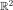 vectors showing pixel translational motion. The pixel motion is caused by relative motion between the robot camera and all of the objects in the robot’s scene. 
* It has been shown in the literature that dense optical flow can be approximated by a 9-DOF homography but that this homography can be reduced to a 6-DOF affine under the assumptions that, between captured frames, the rotation of the robot is yaw-only and small and that the robot's vertical translation is negligible. 
* If we reproject all pixels from the first frame with the approximation affine transformation and compare their landing spots with the landing spots computed with a dense optical flow algorithm, then we reveal all segments of the image that deviate from our assumptions, providing a way of dynamic obstacle detection even when the robot itself is moving.

## The Mathematics that Underpin the Premise
The mathematics that explain the premise involves deriving a homographic transformation to describe how the pixel representation of a given planar scene changes between optical flow images taken closely together in time, then reducing this homographic transformation into an affine transformation leveraging that the robot camera moves between frames but that the camera rotation only involves yaw and that 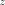-axis translation is small.

* We begin by lifting all pixels belonging to the planar scene into the image plane via the camera intrinsics.

<p align="center">
  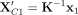
</p>

* The result is a ray indicating 3D direction in the reference frame of the camera before the motion step. We multiply this ray by the constant 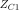 to indicate a 3D image point. 

<p align="center">
  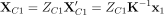
</p>


* Employing the fact that all points being transformed belong to the same plane, 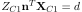, we draw the following sequence to eliminate the  ambiguity. 

<p align="center">
  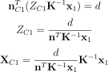
</p>

* With the  ambiguity eliminated, we proceed to model the effect of the camera's between-frame rigid body motion to express the mapping from the original pixel coordinates to post-motion coordinates in the new camera reference frame.  

<p align="center">
  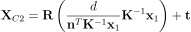
</p>

* We then introduce the structure for the homographic mapping by projecting  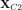 through the camera intrinsic matrix, 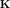, then performing a sequence of algebriac steps that factor out then remove constants shared among all terms of the similarity statement. 

<p align="center">
  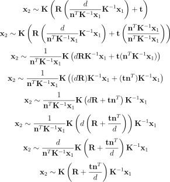
</p>

* Having expressed our homography in terms of camera intrinsics, parameters of the transformed plane, and the rotation and translation that occur between captured frames, we proceed to first examine 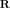 in its expanded form, then reduce it to a simpler form, conformant with our assumptions of how the TurtleBot moves. We employ a first-order linear approximation about the zero-roll, zero-pitch, zero-yaw operating point, then a direct zeroing of the roll and pitch terms.

<p align="center">
  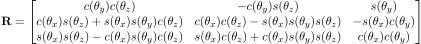
</p>

<p align="center">
  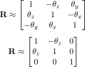
</p>

* We proceed by substituting our simplified  back into the homography, expanding the outer product 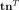, and combining like terms. The resulting form of the homography has plane parameters and extrinsic effects comprising a single matrix.  

<p align="center">
  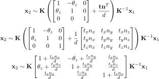
</p>

* Applying the assumption of negligible vertical translation 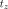 between captured frames, we further simplify the center matrix to reveal an affine structure. Then, as a final step, we confirm that the resulting homography reduces to an affine transformation given the fact that   and 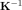 are also affine and the fact that the composition of three affine transformations is always itself an affine transformation.

<p align="center">
  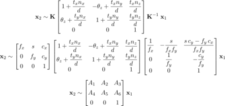
</p>


## The Implementation
The implementation involved the following:

* Standardizing frames obtained from the TurtleBot robot through a resizing operation to reduce computational complexity and a crop around an ROI operation to enforce the planar assumption. 
* Computing the optical flow between successive frames using OpenCV’s Farneback Dense Optical Flow framework (`cv2.calcOpticalFlowFarneback()`) with the default recommended settings.
* Developing an estimation affine 2x3 transformation matrix to model relative motion caused only by the robot’s own motion. This we accomplished with `cv2.estimateAffine2D()` set with RANSAC.
* Developing a detection mask based on the reprojection error between the estimated affine transformation and the apparent motion computed with dense optical flow.
* Stopping the robot when the detection mask, smoothed temporally to maintain object constancy, fills beyond a static threshold. 

## The Results and The Challenges
We are realizing the following results and challenges:
* In repeated trials in simulation tool Gazebo, we have realized accurate dynamic obstacle detection with no false positives. This is demonstrated by the ROS 2 node flagging the robot’s approach to the moving obstacle soda can as being `unsafe` but not flagging any other scenes as being `unsafe`. 
* The fact that our implementation relies on static thresholding for the RANSAC affine fitting step and for the final decision maker step means results will always be scene dependent and will always require parameter tuning. 
    * For example, we have found that the increasing the RANSAC inlier threshold reduces false positives at the sacrifice of not always detecting true dynamic obstacle motion. 
    * Moreover, we have realized that lowering the threshold requirement for mask inliers increases the frequency of false detections.

* Conceptually, the approach as a whole is premised on that dynamic obstacles never occupy the majority of pixels in any pair of successive frames. When this assumption fails to hold true, detections are meaningless.
    * Think of several dozen moving soda cans flooding the robot’s field of view. If this were to happen, the affine fit representing the robot’s own “ego” motion would too much be actually modeling the motion of dynamic obstacles.

### Result Case 1. Robot stationary and dynamic obstacle present.
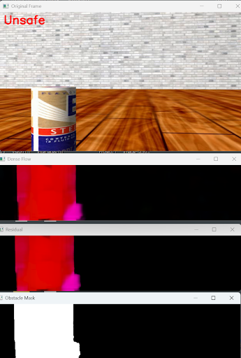

### Result Case 2. Robot moving and dynamic obstacle absent.
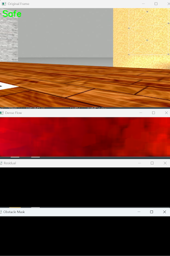

### Result Case 3. Robot moving and dynamic obstacle present. 
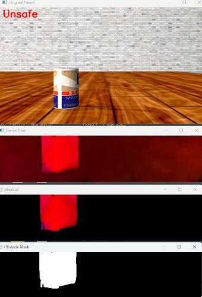

## The Conclusion
* In conclusion, we have validated a well-established conceptual framework for dynamic obstacle detection—one that centers on operating on the direct comparison between computed, apparent dense optical flow and a RANSAC-fitted affine transformation summarizing the “gist” of this dense flow field. That being said, while our results have been intriguing, a truly robust, practical rendition—immune to changes in scene and free from guess and check hard-coded parameter settings—would require additional time researching and understanding more of what’s already been achieved in the literature and in industry. 

## The Test-It-Yourself Instructions

### Ensure Dependencies are Met
This project requires Ubuntu 22.04, ROS 2 Humble, Python 3, as well as the following packages, available via `apt`:

```
ros-humble-desktop
ros-humble-gazebo*           
ros-humble-turtlebot3 
ros-humble-turtlebot3-gazebo  
ros-humble-rqt-image-view  
ros-humble-teleop-twist-keyboard  
ros-humble-cv-bridge  
ros-humble-image-transport  
python3-opencv python3-numpy 
python3-colcon-common-extensions  
```

### Obtain and Build the Necessary ROS 2 Repositories
The code I've developed in this repository, meant for dynamic obstacle detection, is a ROS 2 node designed to work together with the simulation developed by my instructor for this course, Dr. Tommy Chang. To get started, create a ROS 2 workspace, navigate to its source directory, clone both this repository and Dr. Chang's repository, then build both at once with `colcon`. 
```
mkdir -p optical_ws/src
cd optical_ws/src
git clone https://github.com/ronen-aniti-projects/Optical-Flow-Node.git
git clone https://github.com/TommyChangUMD/ENPM673_turtlebot_perception_challenge.git
cd ..
colcon build --symlink-install
```

### Launch the Demonstration

#### Terminal 1: Launch The Gazebo Simulation
```
source install/setup.bash
ros2 launch enpm673_final_proj enpm673_world.launch.py verbose:=true
```

#### Terminal 2: Run the Obstacle Detection ROS 2 Node
```
source install/setup.bash
ros2 run dynamic_obstacle_detector detection_node
```

#### Terminal 3: Run and Configure the ROS2 Teleoperation Node
```
source install/setup.bash
ros2 run teleop_twist_keyboard teleop_twist_keyboard \
  --ros-args -r /cmd_vel:=/input_cmd_vel
```
Importantly, in order to achieve accurate dynamic obstacle detections with the default detector configuration, set, using the `q/z/e/c` keyboard keys, the maximum linear velocity to `0.1 m/s` or lower and the maximum angular velocity to `0.1 rad/s` or lower. 

#### Terminal 4: Run the ROS2 RQt Image Viewer Node
```
source install/setup.bash
ros2 run rqt_image_view rqt_image_view 
```

## Follow-Up: May 31, 2025: Recorded Demonstration: TurtleBot Approaching a Dynamic Obstacle
On May 31, 2025, I published an update for the dynamic obstacle detection node that consolidates, into a single view, the various image processing steps, these being dense optical flow, ego-motion via RANSAC affine, residual image, and RANSAC inlier mask. Because I believe it will aid in understanding of the underlying dynamic obstacle detection detection logic, I have published a screen recording showing the output of this composite image during a dynamic obstacle approach maneuver—the simulation TurtleBot approaching a moving soda can.  

### Demonstration: TurtleBot Approaching a Dynamic Obstacle


## The References
1. G. R. Rodríguez Canosa, “Detección e identificación de objetos dinámicos en sistemas multi-robot,” M.S. thesis, Escuela Técnica Superior de Ingenieros Industriales, Universidad Politécnica de Madrid, Madrid, Spain, 2010. [Online]. Available: https://oa.upm.es/21899/1/GONZALO_RUY_RODRIGUEZ_CANOSA.pdf. Accessed: May 20, 2025.

2. R. I. Hartley and A. Zisserman, _Multiple View Geometry in Computer Vision_, 2nd ed. Cambridge, U.K.: Cambridge University Press, 2004. [Online]. Available: https://www.r-5.org/files/books/computers/algo-list/image-processing/vision/Richard_Hartley_Andrew_Zisserman-Multiple_View_Geometry_in_Computer_Vision-EN.pdf. Accessed: May 20, 2025.

3. Y. Wu, “Optical Flow and Motion Analysis,” EECS432‑Advanced Computer Vision Notes Series 6, Dept. of Electrical Engineering & Computer Science, Northwestern University, Evanston, IL, USA. [Online]. Available: http://users.ece.northwestern.edu/~yingwu/teaching/EECS432/Notes/optical_flow.pdf. Accessed: May 20, 2025.

4. R. Basri, “Paraperspective ≡ Affine,” _International Journal of Computer Vision_, vol. 19, no. 2, pp. 169–180, 1996. [Online]. Available: https://www.weizmann.ac.il/math/ronen/sites/math.ronen/files/uploads/basri_-_paraperspective_affine.pdf. Accessed: May 20, 2025.

5. C. Huang, P. Chen, X. Yang, and K.-T. Cheng, “REDBEE: A Visual‑Inertial Drone System for Real‑Time Moving Object Detection,” arXiv preprint arXiv:1712.09162, Dec. 2017. [Online]. Available: https://arxiv.org/pdf/1712.09162. Accessed: May 22, 2025.

6. B. Hu and J. Luo, “A Robust Semi‐Direct 3D SLAM for Mobile Robot Based on Dense Optical Flow in Dynamic Scenes,” Biomimetics, vol. 8, no. 4, art. 371, 2023. [Online]. Available: https://www.mdpi.com/2313-7673/8/4/371. Accessed: May 22, 2025.

7. Ohnishi, Naoya & Imiya, Atsushi. (2006). Dominant plane detection from optical flow for robot navigation. Pattern Recognition Letters. 27. 1009-1021. 10.1016/j.patrec.2005.11.012. [Online]. Available: https://www.sciencedirect.com/science/article/abs/pii/S0167865505003703. Accessed: May 31, 2025.

8. Kushwaha, Arati & Khare, Ashish & Prakash, Om & Khare, Manish. (2020). Dense optical flow based background subtraction technique for object segmentation in moving camera environment. IET Image Processing. 14. 10.1049/iet-ipr.2019.0960. [Online]. Available: https://www.researchgate.net/publication/345240488_Dense_optical_flow_based_background_subtraction_technique_for_object_segmentation_in_moving_camera_environment. Accessed: May 31, 2025.